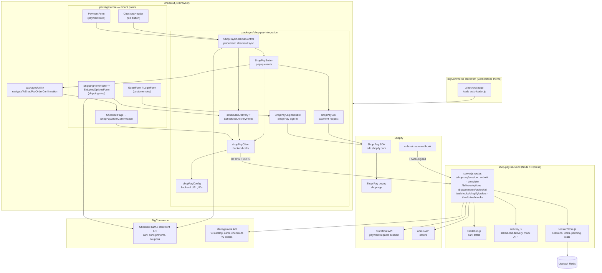
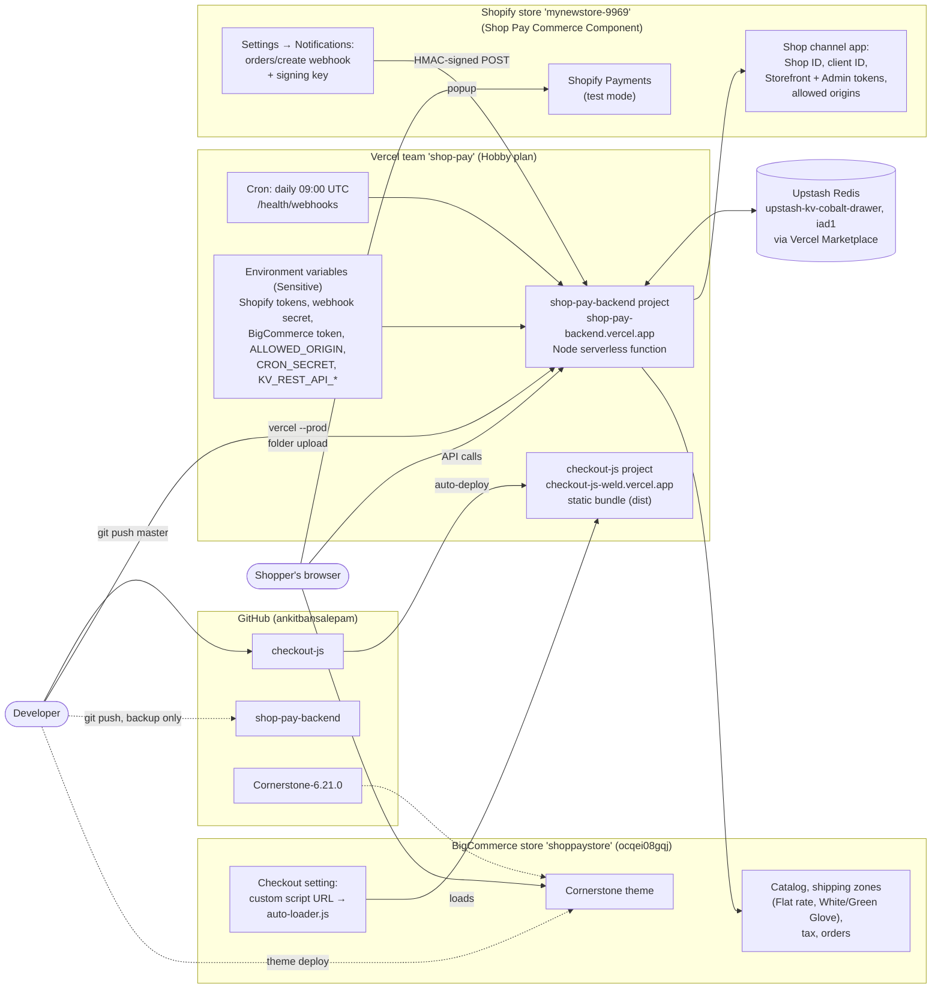

# Shop Pay architecture

How the Shop Pay integration is built and deployed: the modules in each repository, the services they depend on, and where everything runs. For step-by-step flows, see [shop-pay-flow-diagrams.md](shop-pay-flow-diagrams.md); for setup, see [shop-pay-implementation.md](shop-pay-implementation.md).

## 1. Component architecture

The code modules in `checkout-js` and `shop-pay-backend`, and what each one calls.

### Explanation

- **The storefront only loads checkout.** The Cornerstone theme's `/checkout` page loads the custom checkout from `auto-loader.js`, configured in the BigCommerce control panel. The theme has no Shop Pay code.
- **`packages/core` only mounts things.** Five places in the standard checkout render Shop Pay pieces:
  - the customer step (Shop Pay sign-in for recognised emails);
  - the top of checkout and the payment step (the Shop Pay button; exactly one shows);
  - the shipping step (scheduled-delivery options and the date picker);
  - the checkout page (the Shop Pay order confirmation).
- **`packages/shop-pay-integration` holds all Shop Pay logic:**
  - `ShopPayCheckoutControl` decides where the button shows, and keeps the BigCommerce checkout in sync with the popup (address, delivery method, coupons).
  - `ShopPayButton` runs one Shop Pay attempt: it opens the popup, answers its events, submits the payment and calls `/shop-pay/complete`.
  - `shopPaySdk` loads Shopify's script and builds the payment request from BigCommerce's cart.
  - `scheduledDelivery` and `ScheduledDeliveryFields` handle truck delivery: service filtering, the date and instructions.
  - `shopPayClient` wraps the backend calls, and `shopPayConfig` holds the backend URL and the Shop Pay IDs.
- **`packages/utility`** switches to the order confirmation without reloading the page.
- **The backend is a single Express app with three helper modules:**
  - `validation.js`: checks the cart, the final payment request and the total against BigCommerce.
  - `delivery.js`: decides which products need scheduled delivery, and returns the available dates (mock ATP).
  - `sessionStore.js`: sessions, completion locks, pending payments and webhook stats, in Upstash Redis (or a local JSON file in development).
- **External services:**
  - Shopify's Storefront API creates and submits the payment session.
  - Shopify's Admin API confirms that an order was paid.
  - Shopify's `orders/create` webhook is the safety net for creating orders.
  - BigCommerce's Checkout SDK is used in the browser; its Management API is used by the backend for products, carts, checkouts and orders.
- **Security boundaries:**
  - The browser only ever holds public IDs: the Shop ID, the client ID and the backend URL.
  - Every token and secret stays in the backend.
  - The backend accepts browser calls only from allowed origins (CORS). It also checks every webhook's HMAC signature.

## 2. Deployment architecture

Where each part runs, how it's deployed, and where configuration and secrets live.

### Explanation

- **Two Vercel projects, deployed differently:**
  - **checkout-js** deploys automatically on every push to `master`. Vercel builds it with `NX_SKIP_NX_CACHE=true npm run build` and serves the `dist` bundle, including `auto-loader.js`, from `checkout-js-weld.vercel.app`.
  - **shop-pay-backend** is deployed by hand with `vercel --prod`, which uploads the folder. Pushing to GitHub only keeps a copy of the code. It runs as a single Node serverless function at `shop-pay-backend.vercel.app`.
- **Configuration lives in three places:**
  - **Vercel environment variables** (all Sensitive, so they can't be read back): the Shopify Storefront and Admin tokens, the webhook signing secret, the BigCommerce token, the allowed storefront origins, the cron secret, and the Upstash connection added by the Marketplace integration.
  - **BigCommerce:** the checkout's custom script URL (`auto-loader.js`), the products with their custom fields, the shipping zones and methods (Flat rate, White Glove, Green Glove), tax settings, and the orders.
  - **Shopify:** the Shop channel app (Shop ID, client ID, API tokens, allowed origins for the Shop Pay component), the `orders/create` webhook and its signing key (Settings → Notifications), and Shopify Payments (currently in test mode).
- **Upstash Redis** is connected to the backend project through the Vercel Marketplace, in the same region as the function (Washington, D.C., `iad1`), so session reads are fast.
- **The daily cron** runs `/health/webhooks` at 09:00 UTC. The Hobby plan allows only daily cron jobs, and problems are reported only in Vercel's logs.
- **Runtime traffic:**
  - The shopper's browser loads the storefront, which loads checkout from Vercel.
  - The browser then calls the backend directly (CORS-checked) and opens the Shop Pay popup on Shopify.
  - The backend talks to Shopify and BigCommerce server-to-server.
  - Shopify calls the backend back with the signed webhook.
- **The theme** is deployed to BigCommerce separately from the other two, and GitHub holds its source. It needs no Shop Pay changes.
