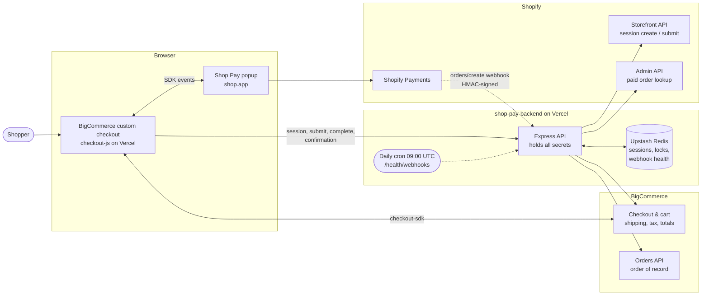
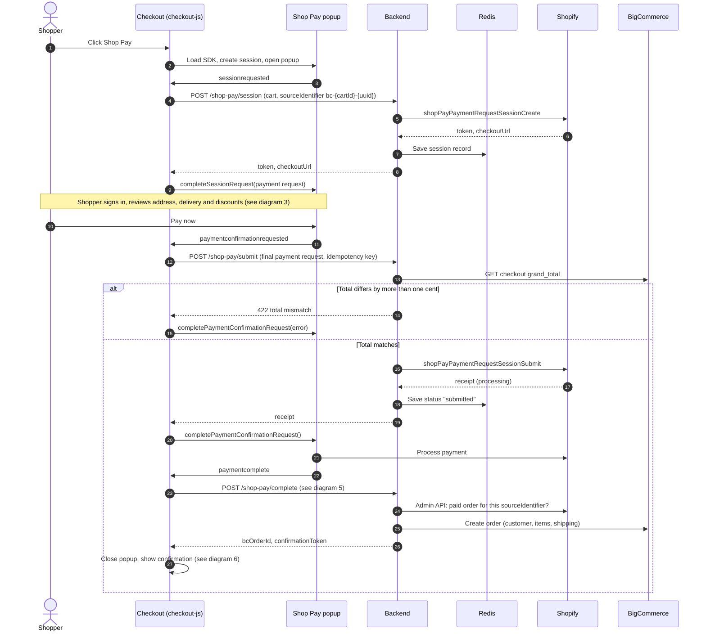
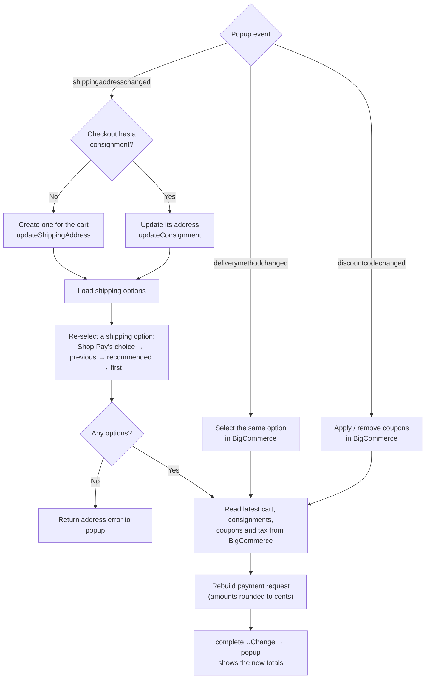
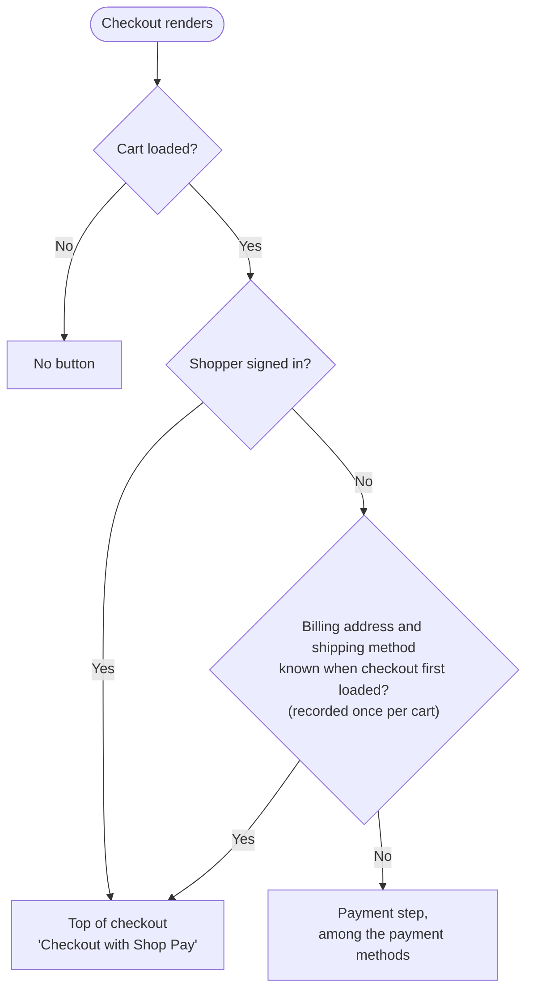
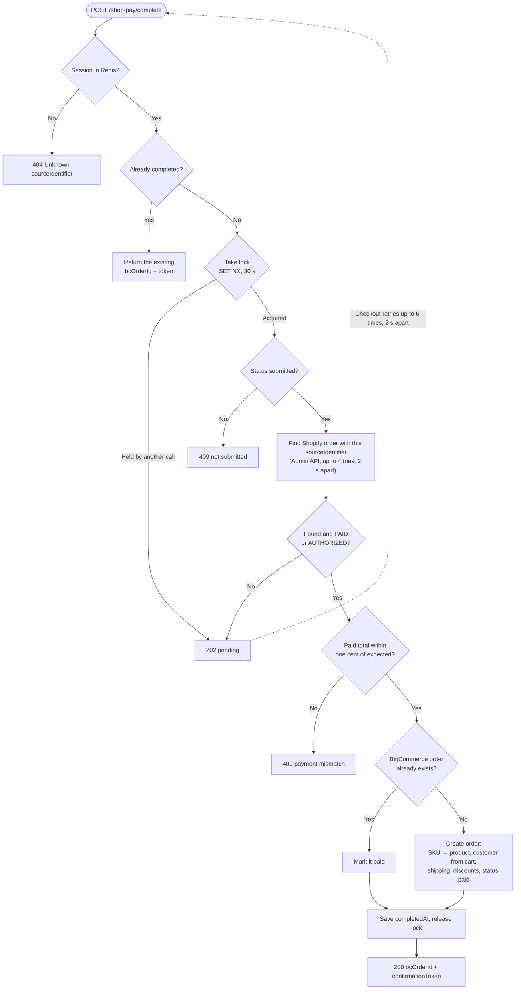
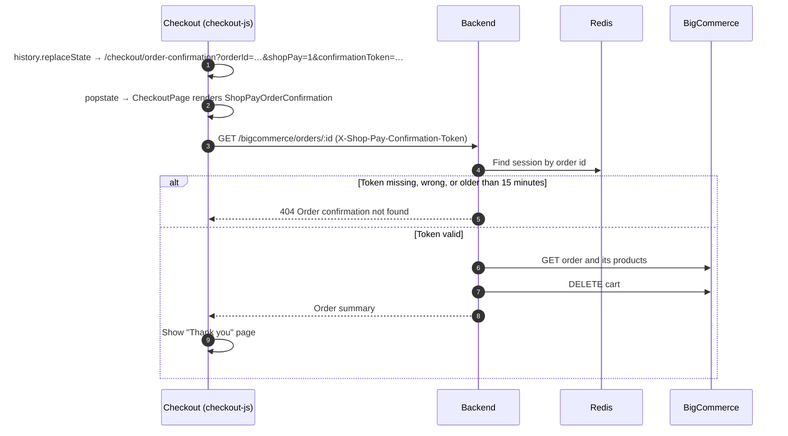
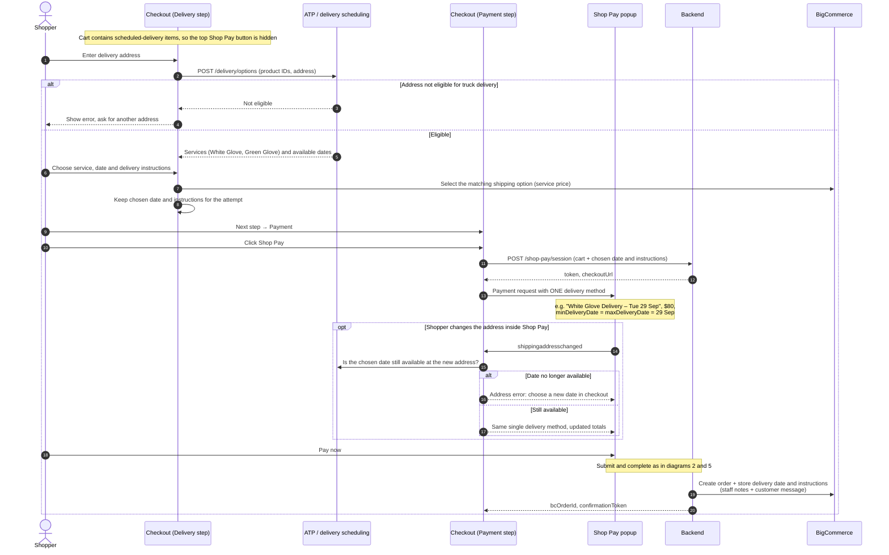
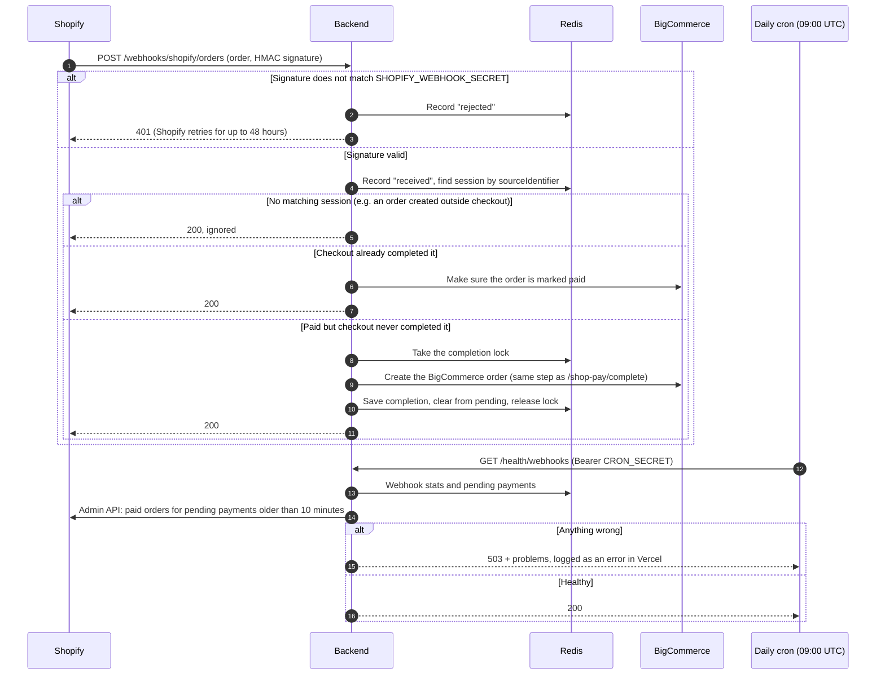

# Shop Pay flow diagrams

Diagrams of the Shop Pay integration between the BigCommerce custom checkout (`checkout-js`), the Shop Pay backend (`shop-pay-backend`), Shopify and BigCommerce. For setup steps, see [shop-pay-implementation.md](shop-pay-implementation.md).

## 1. System overview

Which parts talk to which, and where the secrets live.

### Explanation

- **The shopper only ever sees two things:** the BigCommerce checkout page and the Shop Pay popup. The checkout is our own build of `checkout-js`, served from Vercel. The popup is Shopify's page on `shop.app`, so we don't control its layout or how it selects a card.
- **The checkout talks to three parties:**
  - the popup, through the Shop Pay JavaScript SDK's events;
  - BigCommerce, through `checkout-sdk`, to read and change the cart, shipping and coupons;
  - our backend, to create, submit and complete the payment.
- **The backend holds every secret:** the Shopify Storefront and Admin tokens, and the BigCommerce API token. Nothing secret reaches the browser.
- **Shopify and BigCommerce have different jobs:** Shopify processes the payment through Shopify Payments. BigCommerce remains the order of record for fulfilment, so each successful checkout creates two linked orders, one in each system.
- **Upstash Redis** stores the session for each attempt, so every backend instance on Vercel sees the same data. It also holds short locks that prevent duplicate orders, and the webhook delivery stats.
- **Shopify also calls the backend (dotted line):** when it creates an order, it sends an `orders/create` webhook signed with a secret key. The backend uses it as a safety net, creating the BigCommerce order if checkout never did (see diagram 8).
- **A daily cron job** (09:00 UTC) checks that webhooks are arriving and that no paid order is missing in BigCommerce (see diagram 8).

## 2. End-to-end payment

From the button click to the order confirmation. The BigCommerce order is created only after Shopify confirms the payment.

### Explanation

**Opening Shop Pay (steps 1–9)**
- Clicking the button loads Shopify's SDK and opens the popup. The button stays disabled until the popup closes, so a double click can't start two attempts.
- The popup asks for a session. Checkout sends the cart to the backend with a new ID for this attempt, `bc-{cartId}-{uuid}`. Shopify later stores the same ID on its order, which is how the two orders are matched.
- The backend creates the Shopify session and saves it in Redis. If the popup asks twice, the same session is returned both times; two sessions would leave the popup paying one while the backend submits the other.
- Checkout then gives the popup the full payment request: items, shipping options, the selected shipping line, discounts, tax and total.

**Reviewing (the note)**
- The shopper signs in to Shop Pay and can change the address, delivery method or discount code. Each change goes through BigCommerce first; see diagram 3.

**Pay now (steps 10–20)**
- Checkout sends the final payment request to `/shop-pay/submit` with an idempotency key. The same key is reused if this attempt is retried, so Shopify never charges twice.
- Before submitting, the backend compares the total with BigCommerce's own checkout total. A difference of more than one cent means the page was tampered with or out of sync, and the payment is refused (the `alt` branch). The popup then shows an error and nothing is charged.
- Otherwise the backend submits to Shopify. Submitting only **starts** payment processing, so no BigCommerce order is created yet.

**After payment (steps 21–27)**
- Shopify processes the card and the popup reports `paymentcomplete`.
- Checkout calls `/shop-pay/complete`. The backend creates the BigCommerce order only once Shopify shows a paid order for this attempt (see diagram 5), then returns the order number and a one-time confirmation token.
- Checkout closes the popup and shows the confirmation (see diagram 6).

## 3. Keeping BigCommerce in sync with the popup

Every change in the popup is applied to the BigCommerce checkout first, and the payment request is rebuilt from BigCommerce's state. That keeps the Shop Pay total equal to the BigCommerce total the backend checks.

### Explanation

The popup is where the shopper makes choices, but BigCommerce decides the prices. So every popup change follows the same pattern: apply it to the BigCommerce checkout, read BigCommerce's updated numbers, and send a rebuilt payment request back to the popup.

- **Shipping address changed**
  - If the checkout has no shipping record yet, for example a signed-in shopper who opened Shop Pay straight away, one is created for the whole cart. Otherwise the existing record gets the new address.
  - Changing the address makes BigCommerce drop the selected shipping method, so one is selected again. The order of preference is the method Shop Pay was showing, then the previous one, then BigCommerce's recommended option, then the first available. Without this step the popup would show a shipping charge that the total no longer includes, and Shopify would decline the payment.
  - If BigCommerce has no shipping methods for the address, the popup shows an address error instead.
- **Delivery method changed:** the same option is selected in BigCommerce, so BigCommerce's total, and later the order's shipping, match what the shopper chose.
- **Discount code changed:** codes are applied to or removed from the BigCommerce checkout. Codes BigCommerce rejects are reported back to the popup as invalid.
- **Rebuilding:** the payment request is always built from the latest BigCommerce state, not from the cart as it was when the button was clicked. Tax can change with the address, and shipping can change with a coupon. Amounts are rounded to whole cents, the same way BigCommerce rounds, because BigCommerce amounts can include fractions of a cent.

## 4. Where the Shop Pay button appears

Checkout mounts the button in two places; exactly one renders.

### Explanation

- **Two mounts, one button:** the button is mounted at the top of checkout (`CheckoutHeader`) and in the payment step (`PaymentForm`). Both check the same conditions, so exactly one of them shows it.
- **Signed-in shoppers** always get the button at the top. They usually have saved addresses, and if the checkout doesn't have them yet, the address from Shop Pay is used (diagram 3).
- **Guests** get the top button only if their billing address and shipping method were already on the checkout when it first loaded, for example after returning to checkout. Otherwise the button is in the payment step, alongside the other payment methods.
- **Recorded once per cart:** a guest's readiness is recorded the first time checkout renders for that cart. Filling in addresses during checkout therefore doesn't make the button jump from the payment step to the top. Reloading the page records it again, and BigCommerce has kept the addresses by then, so the top button shows.

## 5. Creating the BigCommerce order (`/shop-pay/complete`)

Runs after the popup reports the payment complete. A failed payment never creates an order, and a lock stops two calls from creating two orders.

### Explanation

This step exists because Shopify's submit only starts the payment. If the BigCommerce order were created at submit, a payment that failed afterwards would leave an order marked paid that was never charged.

- **Early exits**
  - An unknown attempt ID returns 404.
  - An attempt that's already completed returns the same order again, so retries are safe.
- **The lock:** only one call per attempt can create the order. The lock is an atomic Redis key that expires after 30 seconds if a request crashes. A second call that arrives meanwhile gets "pending" and retries, and by then it receives the order the first call created.
- **Finding the payment:** the backend searches recent Shopify orders, through the Admin API, for one with this attempt's ID. Shopify can take a few seconds to create it, so the backend tries 4 times, 2 seconds apart. If the order isn't there yet, or isn't PAID or AUTHORIZED, it answers "pending" (202), and checkout asks again up to 6 times, 2 seconds apart. That's about 30 seconds in total before the shopper sees an error.
- **Checking the amount:** the amount Shopify charged must be within one cent of the total that was submitted. Otherwise no order is created, and the mismatch is logged for investigation.
- **Creating the order:**
  - Each Shop Pay line item is matched to a BigCommerce product by SKU.
  - If the shopper is signed in, the customer is taken from the BigCommerce cart on the server, so the order appears in their account.
  - The order also gets the shipping cost, any discounts, and the "paid" status (Awaiting Fulfillment).
  - If a BigCommerce order already existed for the checkout, it's marked paid instead.
- **Finishing:** the backend saves the completion time and releases the lock, then returns the order number and the confirmation token.
- **The same step runs from the webhook:** when Shopify's `orders/create` webhook arrives, the backend runs this same completion step under the same lock. Whichever arrives first, checkout's call or the webhook, creates the order, and the other finds it done (see diagram 8).

## 6. Order confirmation

Checkout switches to the confirmation without reloading the page, because BigCommerce's own confirmation route can't find orders created through the API and would redirect to the cart.

### Explanation

- **No page reload (steps 1–2):** BigCommerce's own confirmation page looks orders up through its storefront, which can't find orders created through the API; it would send the shopper back to the cart. So checkout changes the address bar to the confirmation URL with `history.replaceState` and renders its own confirmation page (`ShopPayOrderConfirmation`) in place, with no page request.
- **Loading the order (steps 3–4):** the page asks the backend for the order, sending the confirmation token from the URL. The backend finds the attempt through the order number in Redis.
- **The token check (`alt` branch):** the order is shown only if the token matches the one created for this attempt and is less than 15 minutes old. Otherwise the answer is "not found", so nobody can view someone else's order by changing the order number.
- **Showing the order:** with a valid token, the backend reads the order and its products from BigCommerce and deletes the cart, so the shopper's cart is empty afterwards. It then returns a summary, and the shopper sees the "Thank you" page with the order number, items, shipping, tax and total.

## 7. Scheduled truck delivery

> **Status: built, with a mock ATP.** Available dates come from `getAvailableDeliveryDates()` in the backend's `delivery.js` (weekdays and Saturdays from two days out, up to 10 dates, US and Canada), which is the one function to replace with the real ATP API (SHP-15). Slot reservation (SHP-23, Omni Tracks) and the truck-eligibility extension (SHP-24) are out of scope in the estimation sheet.
>
> Test products: "Queen Hybrid Mattress (Scheduled Delivery)" (112) and "Queen Bed Frame (Scheduled Delivery)" (113), marked with the product custom field `delivery_type = scheduled`. Services: the BigCommerce shipping methods White Glove Delivery ($80) and Green Glove Delivery ($99) in the US zone.

How Shop Pay would work for carts that need a scheduled delivery, such as Sleep Country mattresses with White Glove or Green Glove delivery on a chosen date. The shopper keeps Sleep Country's own Delivery step for the service, the date and instructions, and Shop Pay is offered only afterwards, in the Payment step, carrying that single choice.

### Explanation

- **Why Shop Pay comes after the Delivery step:** Shop Pay's popup can only show a list of delivery methods. Shopify's `ShopPayPaymentRequestDeliveryMethodInput` has a label, detail, amount, a delivery-date window (`minDeliveryDate`/`maxDeliveryDate`) and a `deliveryExpectationLabel`, but no calendar, date picker or delivery-instructions field. Sleep Country's Delivery step already collects all three, so Shop Pay only has to carry the result.
- **No express button for these carts:** the top-of-checkout Shop Pay button would skip the Delivery step. For carts with scheduled-delivery items it would be hidden, and Shop Pay offered only in the Payment step. Parcel-only carts keep the express button.
- **Eligibility and dates (steps 1–5):** after the address is entered, ATP returns which services and dates are available for that address and those items. An ineligible address is stopped here, before payment (SHP-06).
- **The shopper's choice (steps 6–8):** the chosen service is selected as the BigCommerce shipping option, so its price is in BigCommerce's total and the backend's total check still works. The date and instructions are kept for this checkout attempt.
- **One delivery method in the popup (steps 9–13):** the payment request carries only the chosen service and date, with the date in both `minDeliveryDate` and `maxDeliveryDate`, so Shop Pay shows the exact delivery day and the shopper can't pick a different service there.
- **Address changed in the popup (the `opt` block):** truck availability depends on the address, so the chosen date is checked again. If it's no longer available, the popup shows an address error telling the shopper to pick a new date in checkout; otherwise the same delivery method is returned with updated totals (tax can change with the address).
- **Storing the schedule (last steps):** payment runs exactly as in diagrams 2 and 5. At Pay now, the backend also rejects a scheduled cart without a scheduled service or an available date. BigCommerce orders have no delivery-date field, so the backend writes the service, date and instructions to the order's staff notes (for example "Scheduled delivery: Green Glove Delivery on Mon, Sep 28 (2026-09-28)") and the date to the customer message.
- **In the shipping step:** scheduled carts see only the scheduled services; other carts don't see them. If BigCommerce has another method selected (e.g. Flat rate), checkout switches to a scheduled service. Continue stays disabled until an eligible address and a date are chosen. The choice is kept in the browser session, per cart.
- **Alternative, if express checkout is a must:** list each service-and-date combination as its own delivery method in the popup, for example "White Glove – Tue 29 Sep". This keeps the top button, but the list grows quickly (2 services × 5 dates = 10 options), there's still nowhere for instructions, and Shopify doesn't document a maximum number of delivery methods.

## 8. Webhook safety net and health check

What happens when Shopify's `orders/create` webhook arrives, and how the daily health check spots problems. This covers the case where the shopper pays but checkout never finishes, for example because they closed the tab.

### Explanation

- **Where the webhook comes from:** it's created in Shopify Admin (Settings → Notifications → Webhooks) for the live backend URL. Shopify signs every delivery with the key shown on that page, stored in Vercel as `SHOPIFY_WEBHOOK_SECRET`. A webhook created through the Admin API wouldn't work: the Shop channel app never shows the secret it signs with.
- **The signature check (steps 1–3):** the backend recomputes the signature from the raw request body. A mismatch is rejected with 401 and recorded, so a fake "order paid" message can never create an order. Shopify retries rejected deliveries for up to 48 hours.
- **Three cases for a valid delivery (steps 4–11):**
  - **No matching session:** the Shopify order didn't come from our checkout, for example Shopify's own test notification, so it's ignored.
  - **Already completed:** checkout's `/shop-pay/complete` created the order first, which is the normal case. The webhook only makes sure the order is marked paid.
  - **Paid but never completed:** the shopper paid but checkout never called `/shop-pay/complete`. The webhook creates the BigCommerce order itself, using the same completion step and lock as diagram 5, so a payment never gets two orders.
- **If processing fails:** the backend answers 500 and records the failure, and Shopify retries the delivery later.
- **The health check (steps 12–16):** a Vercel cron job calls `/health/webhooks` once a day. The team's Vercel Hobby plan doesn't allow more often. It reports a problem when:
  - no webhook delivery has ever been verified;
  - the secret is missing, or the latest delivery was rejected;
  - a webhook failed in the last 24 hours;
  - Shopify has a paid order for a payment submitted more than 10 minutes ago, but BigCommerce has no order for it.
- **Stale entries are cleaned up:** payments that were never paid (declined or abandoned) are dropped from the pending list after 24 hours.
- **Where problems show up:** only in Vercel's logs, as `[health] webhook problems`. Slack or email alerts would need a channel to send them to.
